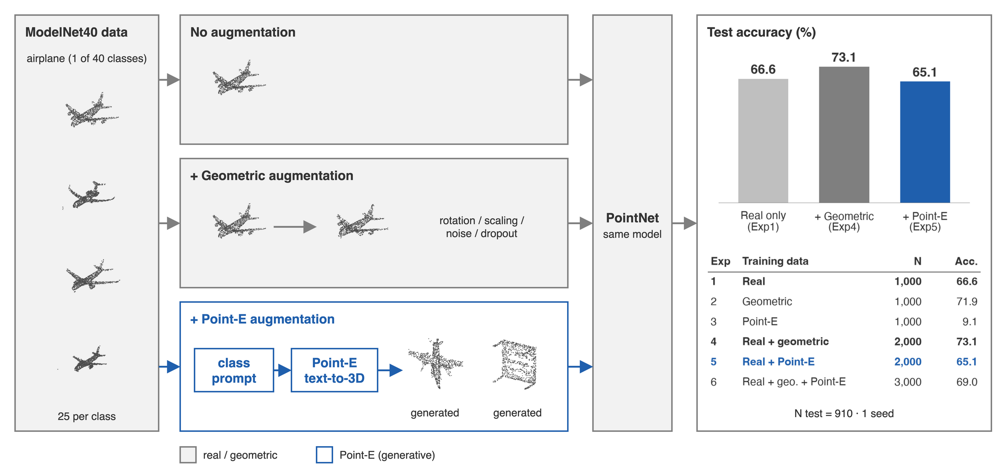

# Geometric vs Point-E Augmentation for PointNet — geometric wins by 8.0 pts

On ModelNet40 with 25 training samples per class, generative (Point-E) augmentation
does **not** beat geometric augmentation: added to real data it reaches **65.1%** test
accuracy vs **73.1%** for geometric (−8.0 pts), and on its own **9.1%** vs **71.9%**.
The real-only baseline is **66.6%**.



## Key result

| Setting (ModelNet40, 25 train / class) | Real only | + Geometric | + Point-E | Point-E vs Geometric |
|---|---|---|---|---|
| Test accuracy, real + augmented (%) | 66.6 | **73.1** (+6.5) | 65.1 (−1.5) | −8.0 pts |
| Test accuracy, augmented data only (%) | 66.6 | **71.9** (+5.3) | 9.1 (−57.5) | −62.8 pts |

*1 run / 1 seed (42) per setting; test N = 910 (ModelNet40 test split, 20–25 per class); train N = 1,000 per data source.
Differences are from a single seed and have no confidence interval. Full tables: [`results/NUMBERS.md`](results/NUMBERS.md).*

## Motivation

PointNet-style classifiers need lots of labelled shapes, and geometric augmentation
(rotate, scale, add noise) only reshuffles shapes you already have. Text-to-3D diffusion
models such as Point-E can produce *new* shapes for any class name, which could help
when real data is scarce. We tested whether those synthetic shapes help a
classifier trained on only 25 real samples per class, compared with plain geometric augmentation.

## Method

Six training sets, 25 samples per class per source, same PointNet, same test set:

| Exp | Training data |
|---|---|
| 1 | Real only (baseline) |
| 2 | Geometric-augmented only |
| 3 | Point-E generated only |
| 4 | Real + geometric |
| 5 | Real + Point-E |
| 6 | Real + geometric + Point-E |

Key design choices:
1. **Class-name prompts for Point-E.** Each class gets 10 prompt templates ("a 3D point cloud of a {class}", …) and 25 samples from the base and upsampler models, all kept without filtering (`2_aigc_point_e_generation/Generating_Image_PointE.py`).
2. **Geometric augmentation.** Each real shape is transformed once, offline: Y-axis rotation U[−15°, 15°], scale U[0.9, 1.1], Gaussian noise with σ = 0.02 and random dropout of 10% of points (`1_traditional_augmentation/Traditional_Augmentation.ipynb`).
3. **Equal budget per source.** Every source contributes 1,000 shapes, normalised to 1,024 points in the unit sphere, so the comparison is per-sample rather than per-dataset-size.

Training uses 50 epochs, Adam with lr 1e-3, batch 32 and seed 42 (`3_training_pointnet/preprocess_and_train.py`).
Exp1 is trained from scratch. **Exp2–6 are fine-tuned from the Exp1 checkpoint**, so they get 50 more epochs than the baseline.

## Results

| Exp | Training data | Test acc (%) | Macro-F1 (%) | Δ acc vs Exp1 |
|---|---|---|---|---|
| 1 | Real only | 66.6 | 65.7 | — |
| 2 | Geometric only | 71.9 | 71.2 | +5.3 |
| 3 | Point-E only | 9.1 | 6.8 | −57.5 |
| 4 | Real + geometric | **73.1** | **72.0** | **+6.5** |
| 5 | Real + Point-E | 65.1 | 63.0 | −1.5 |
| 6 | Real + geometric + Point-E | 69.0 | 68.6 | +2.4 |

Test N = 910 and 1 seed for every row. The numbers are recomputed from the saved per-sample predictions (`4_evaluation_ablation/test_result_csv/`).
Per-class accuracies are in [`results/NUMBERS.md`](results/NUMBERS.md).

- **Geometric augmentation helps:** Exp4 improves over the baseline on 23 of 40 classes and gets worse on 10.
- **Point-E does not help at this scale:** Exp5 improves on 16 classes and gets worse on 18. Adding Point-E on top of geometric augmentation (Exp6, 69.0%) lowers accuracy compared with geometric augmentation alone (Exp4, 73.1%).
- **Failure case:** the Point-E-only model (Exp3) collapses to 9.1%. It is the baseline model fine-tuned on synthetic shapes only, so it drifts to Point-E's shape distribution: its training accuracy is 90.3%, but on the real test set it predicts only 34 of the 40 classes. Visual inspection showed many generated shapes with broken or ambiguous geometry.

Limitations: there is one seed, and the per-class test sets have only 20–25 samples. Exp2–6 also get extra epochs from fine-tuning. Treat gaps of a few points as noise. The 8-pt gap between Exp4 and Exp5 and the Exp3 collapse are large enough to report.

## Reproduce

Not verified end-to-end. Results were produced with commit `7714863`. A full run needs:

- **Environment:** Python 3 with `requirements.txt` (torch 2.6.0, CUDA 12.4, `point-e` installed from github.com/openai/point-e). Point-E generation needs a CUDA GPU.
- **Data:** ModelNet40 (`modelnet40_hdf5_2048/` for the test set). `Data/` here ships only the `airplane` class for each experiment, plus the training logs and checkpoints.
- **Order:** `1_traditional_augmentation/` → `2_aigc_point_e_generation/Generating_Image_PointE.py` → `3_training_pointnet/preprocess_and_train.py --stage all` → `4_evaluation_ablation/build_test_dataset.py`, `evaluate_model.py`.

Re-deriving the tables and figure from the saved predictions needs only Python 3 and matplotlib:

```bash
python results/extract_numbers.py && python results/plot.py
```

## Context

- **Type:** Course project, CIE6004 (Prof. Rui Huang), The Chinese University of Hong Kong, Shenzhen
- **Period:** Jan 2025 – May 2025
- **Collaborators:** Team of 4. Junseok Kim (lead), Kai Ye (preprocessing, PointNet training), Jiaheng Xu (evaluation, ablation), He Gao (report writing)
- **My contribution:** Team lead. I initiated the project idea and defined the six experiment configurations. I built the Point-E generation pipeline (`2_aigc_point_e_generation/`), including prompt design and sampling (every generated sample is kept; there is no quality filter), and the geometric augmentation (`1_traditional_augmentation/`). Training (`3_training_pointnet/`) and evaluation (`4_evaluation_ablation/`) code are by teammates. For this README I re-derived the results from the saved predictions (`results/`).
- **Status:** Completed (archived)

## Citation / Acknowledgements

- **Point-E** is OpenAI's model, used unmodified via [openai/point-e](https://github.com/openai/point-e) (MIT). Nichol, A., Jun, H., Dhariwal, P., Mishkin, P., Chen, M. *Point-E: A System for Generating 3D Point Clouds from Complex Prompts.* arXiv:2212.08751, 2022.
- **PointNet:** Qi, C. R., Su, H., Mo, K., Guibas, L. J. *PointNet: Deep Learning on Point Sets for 3D Classification and Segmentation.* CVPR 2017.
- **ModelNet40:** Wu, Z. et al. *3D ShapeNets: A Deep Representation for Volumetric Shapes.* CVPR 2015. https://modelnet.cs.princeton.edu/

License: MIT, for educational and research use.
